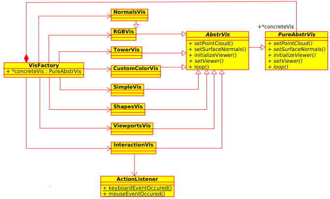
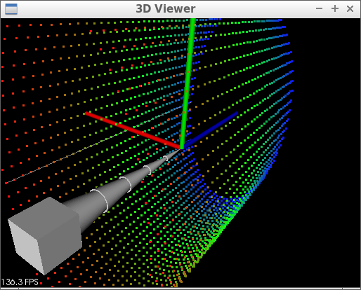

# PCL

The program <a href="./prog.cpp">here</a> is a slight modification of the original demo program <i><a href="http://pointclouds.org/documentation/tutorials/pcl_visualizer.php">pcl_visualizer_demo.cpp</a></i> for the Point Cloud Library. The main changes are:
 
- Implementation of different visualization schemes based on class inheritance
 
- Substituting all stand-alone functions, including event-handlers, with (methods of) classes
 
- Exemplifying meaningful adjustment of parameters in a multi-component scene (using the new visualization scheme "Tower")

 

  

