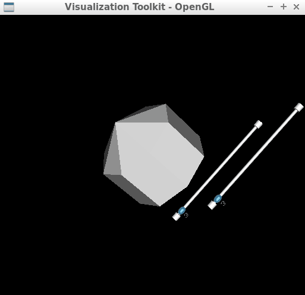

# Higher-level architectures for using 3D C++ APIs

The C++ programs here (<a href="./VTK/prog.cpp">VTK</a> and <a href="./PCL/prog.cpp">PCL</a>) are simply modifications of two sample programs provided by these two 3D visualization APIs. The new programs here introduce intermediate (higher-level) architectures to separate <a href="https://en.wikipedia.org/wiki/Model%E2%80%93view%E2%80%93controller">different tasks</a> from each other and to make modifications easy and systematic. They also exemplify the use and inheritance of the API classes and similar smart-pointers.
 

 

  

