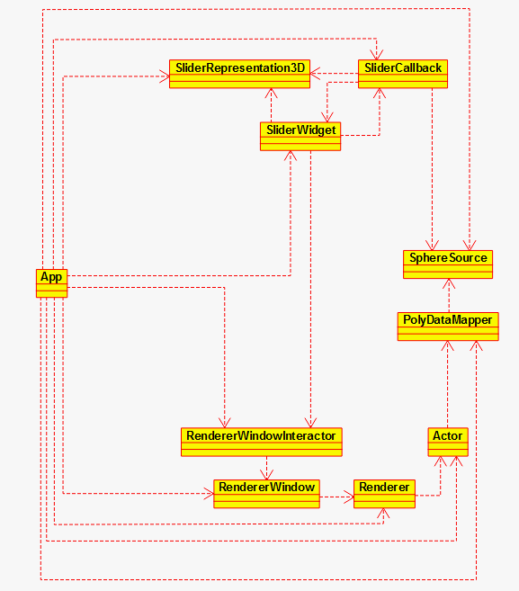

# VTK

The C++ program <a href="./prog.cpp">here</a> is simply a modification of the sample program <a href="http://www.vtk.org/Wiki/VTK/Examples/Cxx/Widgets/Slider">Slider</a>; both to be used with the <a href="http://www.vtk.org/doc/nightly/html/index.html">VTK API</a>. The new program uses an additional intermediate (higher-level) architecture. It separates <a href="https://en.wikipedia.org/wiki/Model%E2%80%93view%E2%80%93controller">different tasks</a> from each other, and makes modifications such as multi-slider designs easy and systematic.

 

  

